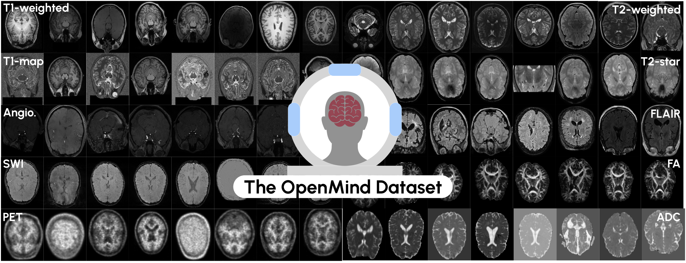

## An OpenMind for 3D medical vision self-supervised learning
Copyright German Cancer Research Center (DKFZ) and contributors. Please make sure that your usage of this code is in compliance with its license.

This is the main repository associated for the paper `An OpenMind for 3D medical vision self-supervised learning`, intended for the Review.
It holds the code for the self-supervised pre-trainings conducted in the Benchmark study.

Currently it includes the **ResEnc-L** [[a](https://arxiv.org/abs/2410.23132),[b](https://arxiv.org/abs/2404.09556)] CNN architecture and the [Primus-M](https://arxiv.org/abs/2503.01835) Transformer architecture, as well as the following pre-training methods for both architectures, where applicable
1. [Volume Contrastive (VoCo)](https://arxiv.org/abs/2402.17300)
2. [VolumeFusion (VF)](https://arxiv.org/abs/2306.16925)
3. [Models Genesis (MG)](https://www.sciencedirect.com/science/article/pii/S1361841520302048)
4. [Default MAE (MAE)](https://openaccess.thecvf.com/content/CVPR2022/html/He_Masked_Autoencoders_Are_Scalable_Vision_Learners_CVPR_2022_paper)
5. [Spark 3D (S3D)](https://arxiv.org/abs/2410.23132)
6. [SimMIM (SimMIM)](https://openaccess.thecvf.com/content/CVPR2022/html/Xie_SimMIM_A_Simple_Framework_for_Masked_Image_Modeling_CVPR_2022_paper.html)
7. [SwinUNETR pre-training  (SwinUNETR)](https://arxiv.org/abs/2111.14791)
8. [SimCLR (SimCLR)](https://arxiv.org/abs/2002.05709)

-----
### Complementary resources:

**[OpenMind Dataset](https://huggingface.co/datasets/AnonRes/OpenMind)**

**[Segmentation Fine-tuning Framework](https://github.com/TaWald/nnUNet)**

**[Classification Fine-tuning Framework](https://github.com/constantinulrich/SSL3D_classification)** Simple framework that allows 3D image classification. 

**[OpenMind pre-trained Checkpoints](https://huggingface.co/collections/MIC-DKFZ/openmind-models-6819c21c7fe6f0aaaab7dadf)**
*You don't need to manually download the checkpoints (for segmentation). The framework will automatically download the checkpoints for you*

----

For installation and the general pre-training workflow with `nnssl`, see the main [readme](../readme.md). For a step-by-step guide to pre-training on OpenMind, see [Getting started with OpenMind](Getting_started_OpenMind.md).
